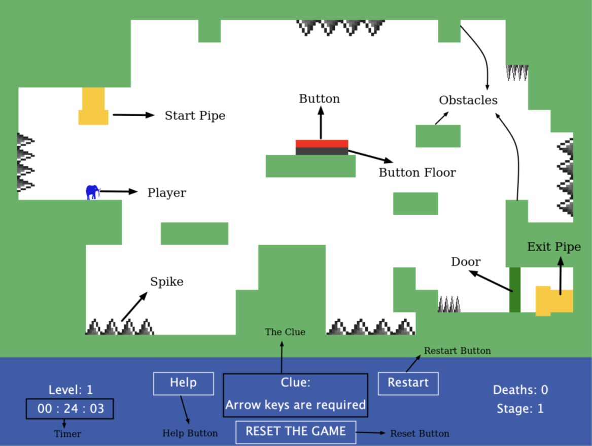
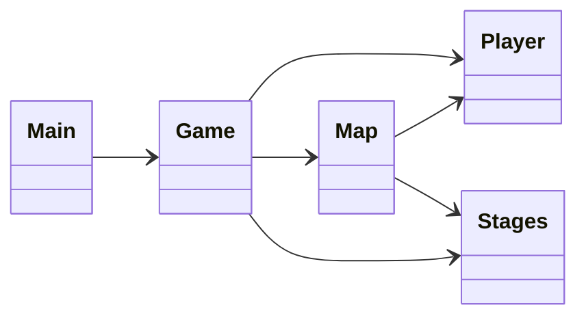

# 🐘 This Is the Only Level (Java & OOP)

> **"The level is the same, but the rules change every time!"**

This project is an Object-Oriented recreation of the Flash game *"This Is the Only Level"*, developed using **Java** and the **StdDraw** library. Unlike a standard platformer, the player loops through the same map layout, but each "Stage" introduces a new rule or physics mechanic.

  
   
  <em>Figure 1: Game Environment with obstacles, spikes, and UI elements</em>

## 🎮 Game Mechanics & Stages
The game consists of **5 unique stages**, each demanding a different strategy:
1.  **Stage 1 (Standard):** Standard arrow key controls.
2.  **Stage 2 (Reverse):** Left/Right movement keys are reversed.
3.  **Stage 3 (Auto-Jump):** Constant auto-jumping mechanic.
4.  **Stage 4 (Repetition):** The door button must be pressed **5 times**.
5.  **Stage 5 (Custom Input):** Custom controls using keys **F, T, and H**.

## 🏗️ Technical Architecture (OOP)
The project is built on a modular OOP architecture. The system is designed to handle different game states using polymorphism in the Stage class.

### Class Responsibilities
- **`Main.java`:** Entry point; initializes Stages and starts the Game loop.
- **`Game.java`:** Manages the core loop, UI rendering (banners, timer), and user input handling.
- **`Map.java`:** Handles collision detection (penetration logic), object rendering, and interactions.
- **`Player.java`:** Manages physics (velocity, gravity), state (jumping, grounded), and movement logic.
- **`Stage.java`:** A configuration class that defines the unique rules (gravity, control scheme, clues) for each level.

## 🛠️ Technologies
- **Language:** Java
- **Library:** StdDraw (Princeton) for 2D Graphics.
- **Concepts:** OOP, Game Physics, Collision Detection.

## 📄 Project Report
For a deep dive into the implementation details and class diagrams, you can view the full report here:
[📄 Read the Project Report (PDF)](./report/report.pdf)

---
*Developed by Melih Efe Sonmez.*
